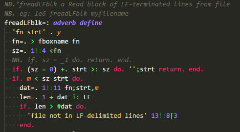

# j

This [VS Code](https://code.visualstudio.com) extension provides support for the [j programming language](http://www.jsoftware.com/).

## Features

The extension currently provides syntax highlighting.

>The above code snippet uses the Monokai color theme with some tweaks discussed below.

## Requirements

Getting the j extension for VS Code to work involves two steps: 1.
Install VS Code, 2. Install the j extension.
Assuming you've installed [VS Code](https://code.visualstudio.com/) to install the j extension, start VS Code. Inside VS Code, go to the extensions view either by
executing the ``View: Show Extensions`` command (click View->Command Palette...)
or by clicking on the extension icon on the left side of the VS Code
window.

In the extensions view, simply search for the term ``j`` in the marketplace
search box, then select the j extension and click the install button. Note that it may be easier to search for the publisher (``tikkanz``) rather than ``j``.
You might have to restart VS Code after this step.

To provide highlighting for some of the ``j``'s additional language features not commonly catered for in most color themes, a number of suggested additions for your User Settings are provided in the ``user_settings_j.json`` file. The colors used work well with the Monokai theme.

## Release Notes

See the [Change Log](CHANGELOG.md) for release notes.

-----------------------------------------------------------------------------------------------------------
